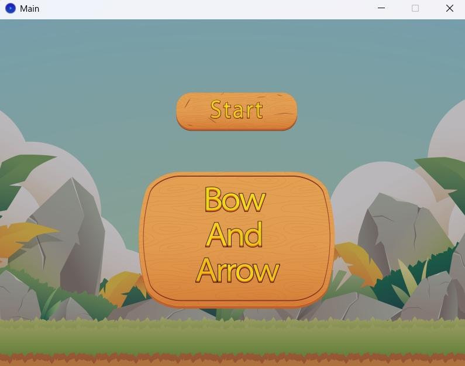
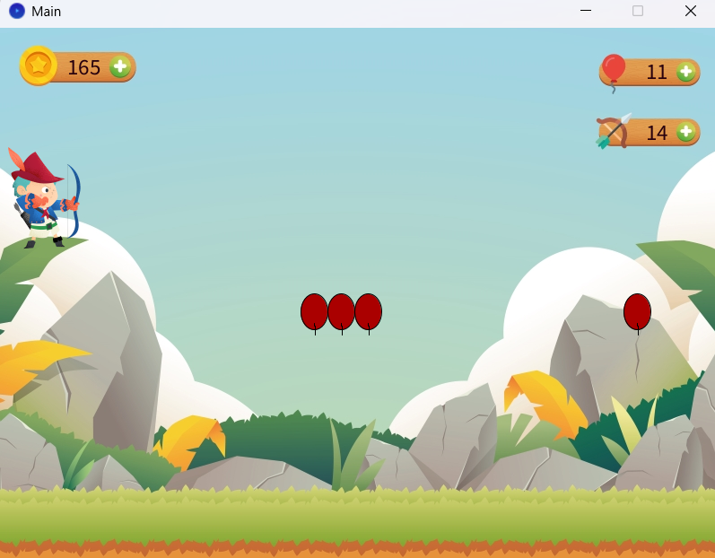
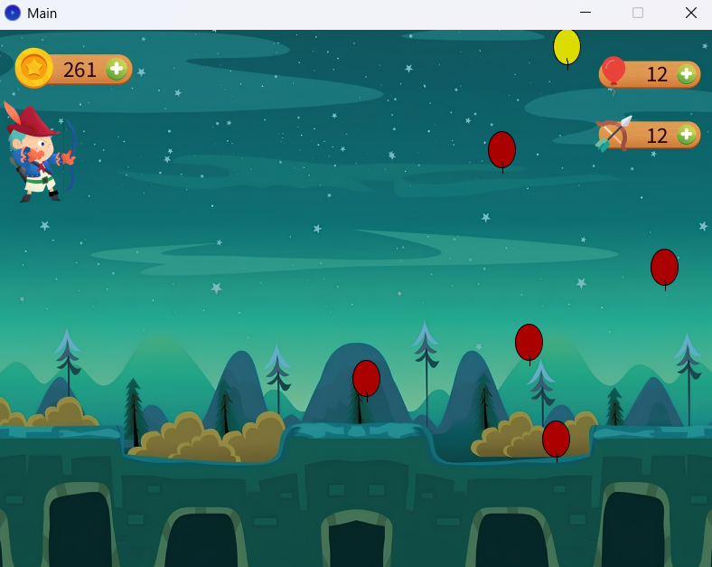

# Bow and Arrow Game


---

## Table of Contents
- [Overview](#overview)
- [Features](#features)
- [Gameplay](#gameplay)
- [Screenshots](#screenshots)
- [Architecture](#architecture)
- [Installation](#installation)
- [Development](#development)
- [Project Structure](#project-structure)
- [Dependencies](#dependencies)
- [Contributing](#contributing)
- [License](#license)
- [Acknowledgments](#acknowledgments)

---

## Overview

Bow and Arrow Game is a 2D archery simulation developed using the Processing framework. The game challenges players to aim, shoot, and score points by hitting moving targets, featuring realistic physics and engaging gameplay mechanics.

---

## Features
- Two levels with increasing difficulty (red and yellow balloons)
- Realistic arrow shooting and movement
- Score system based on performance
- Limited arrows per level (quiver system)
- Sound effects for actions and events
- Start, transition, and congratulatory screens
- Mouse-based aiming and shooting
- Retry option when out of arrows

---

## Gameplay

**Controls:**
- Mouse movement: Aim
- Mouse click and hold: Draw bow
- Mouse release: Shoot arrow
- R: Reset game
- P: Pause or resume

**Objectives:**
- Hit as many targets as possible to maximize your score
- Complete level-specific challenges to unlock new content

---

## Screenshots

<p align="center">
  
  <br>
  
  <br>
  
</p>

---

## Architecture

- **Main.pde:** Game loop, state management, and event handling
- **Archer.pde:** Player character logic and input
- **Arrow.pde:** Arrow physics, trajectory, and collision
- **Ballon.pde:** Target behavior and scoring
- **Level.pde:** Level progression and environment setup
- **Score.pde:** Scoring, achievements, and persistence
- **Assets:**
  - `data/imgs/`: Sprites and backgrounds
  - `data/sounds/`: Sound effects

---

## Installation

### Prerequisites
- Processing IDE (version 3.0 or higher)
- Java Runtime Environment (JRE) 8 or higher

### Steps
1. Clone the repository:
   ```bash
   git clone https://github.com/yourusername/bow-and-arrow-game.git
   ```
2. Navigate to the project directory:
   ```bash
   cd bow-and-arrow-game
   ```
3. Open `Main.pde` in Processing IDE
4. Install required libraries via Processing's library manager if prompted
5. Run the project

---

## Development

- Use Processing IDE for editing and running the code
- Follow the modular structure for adding new features or fixing bugs
- Visual Studio Code with the Processing extension is recommended for advanced editing

---

## Project Structure

```
bow-and-arrow-game/
├── B_A/
│   ├── data/
│   │   ├── imgs/
│   │   │   ├── backgrounds/
│   │   │   ├── chars/
│   │   │   └── screenshots/
│   │   └── sounds/
│   ├── Main.pde
│   ├── Archer.pde
│   ├── Arrow.pde
│   ├── Ballon.pde
│   ├── Level.pde
│   └── Score.pde
└── README.md
```

---

## Dependencies
- Processing Core Library
- Sound Library
- (Optional) Physics Library
- Java Development Kit (JDK)
- Git

---

## Contributing

Contributions are welcome. To contribute:
1. Fork the repository
2. Create a feature branch
3. Commit your changes with clear messages
4. Push to your branch
5. Open a Pull Request

**Guidelines:**
- Follow the existing code style
- Add comments for complex logic
- Update documentation as needed
- Test your changes

---

## License

This project is licensed under the MIT License. See the [LICENSE](LICENSE) file for details.

---

## Acknowledgments
- Processing Foundation
- Open source contributors
- Game development community

---

For support or questions, please open an issue in the GitHub repository.
